# My Advent of Code solutions
Hi!
I'm Niklas, a rubyist, and I solve Advent of Code each december. Here are my solutions.

<!-- AOC TILES BEGIN -->
<h1 align="center">
  Advent of Code - 210/466 ⭐
</h1>
<h1 align="center">
  2024 - 16 ⭐ - Ruby
</h1>

<a href="aoc/y2024/d08.rb">
  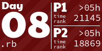
</a>
<h1 align="center">
  2023 - 50 ⭐ - Ruby
</h1>

<a href="aoc/y2023/d12.rb">
  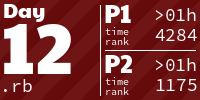
</a>

<a href="aoc/y2023/d21.rb">
  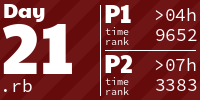
</a>

<a href="aoc/y2023/d24.rb">
  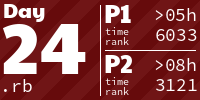
</a>

<h1 align="center">
  2022 - 50 ⭐ - Ruby
</h1>

<a href="aoc/y2022/d11.rb">
  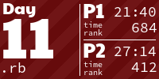
</a>

<a href="aoc/y2022/d13.rb">
  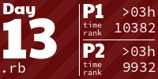
</a>
<a href="aoc/y2022/d14.rb">
  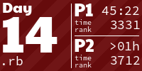
</a>

<a href="aoc/y2022/d25.rb">
  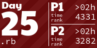
</a>
<h1 align="center">
  2021 - 50 ⭐ - Ruby
</h1>

<a href="aoc/y2021/d06.rb">
  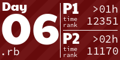
</a>

<a href="aoc/y2021/d11.rb">
  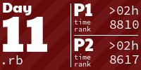
</a>

<a href="aoc/y2021/d21.rb">
  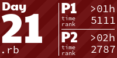
</a>
<a href="aoc/y2021/d22.rb">
  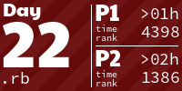
</a>

<a href="aoc/y2021/d24.rb">
  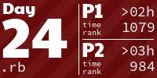
</a>

<h1 align="center">
  2020 - 44 ⭐ - Ruby
</h1>

<a href="aoc/y2020/d11.rb">
  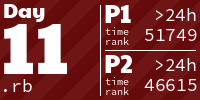
</a>

<!-- AOC TILES END -->

*The above tiles are clickable, leading to the solution of the corresponding day.*
